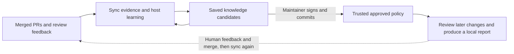

# Review Memory

English | [Simplified Chinese](README.zh.md)

A Copilot skill that lets a project's review knowledge **grow like a snowball**:
learn from merged PRs, preserve useful lessons, use approved knowledge in later
reviews, and refine that memory as new PR feedback arrives.

**PR experience -> project memory -> knowledge-informed reviews -> new PR experience.**

[How it works](#how-it-works) | [Install](#install) | [First use](#first-use-select-your-project)

## Design philosophy

A PR review often explains more than a code change: why an interface has a certain
contract, which tradeoff matters to the team, or when an apparent anti-pattern is
actually valid. That reasoning should remain useful after the PR closes, rather
than having to be rediscovered in every review or chat session.

The unit of evolution is **the project's knowledge, not the model's weights**.
Each learning round compares new evidence with saved lessons. It can add support
for an existing principle, expose a counterexample, or motivate a revision or
retirement. The goal is not an ever-growing blacklist, but increasingly precise
knowledge of this project's decisions and their limits.

A useful lesson records its principle, applicable paths and context, exceptions,
valid and violating examples, and versioned evidence links. Repeated comments,
resolved threads, and merged PRs are evidence to interpret, not automatic team
consensus or permission to enforce a rule.

**Illustrative evolution, not actual repository evidence:** one PR motivates
preserving diagnostic context at request boundaries. Another reveals that
sensitive request values must be excluded. A later refactor centralizes context
handling, motivating a narrower rule. The memory should retain these observations
and support revised proposals, not turn the first comment into "log everything."

### What runs where

This is **one skill**, with responsibilities deliberately separated:

| Part | Responsibility |
| --- | --- |
| Skill instructions and workflow references | Guide the assistant through collection, learning, approval, and review. |
| Host assistant, such as Copilot | Read evidence, relate new observations to existing knowledge, propose lessons, and reason about current changes. |
| Bundled Python CLI | Collect through authenticated `gh` reads, preserve progress, validate evidence and signatures, run eligible fixed detectors, and write local artifacts. It does not call a model API. |
| Target project's `.review` directory | Keep project memory across sessions, separately from the installed skill. |
| Rust reference packs | Supply review questions and counterexamples, not repository policy or independently triggered skills. |

## How it works



1. **Collect evidence.** `sync` reads merged PR reviews and discussions in bounded,
   resumable batches. It preserves evidence versions and available code context;
   missing source or failed API reads remain visible gaps.
2. **Relate, learn, and save.** The host reads both new evidence and the existing
   knowledge index, considers support and counterexamples, and proposes scoped
   lessons or revisions. `propose` validates and saves the result; `status` rebuilds
   the cumulative index. Exact matching lessons are grouped with their evidence;
   semantic merging requires host reasoning. A PR need not yield a new lesson.
3. **Approve deliberately.** Learning does not require approval. To use a lesson
   as review policy, a maintainer inspects and SSH-signs an exact revision through
   the [approval workflow](.github/skills/review-memory/references/approval.md).
   Verified knowledge and approval records must then be committed to an
   independently trusted target branch. Static detectors need separate approval;
   the assistant never signs or grants itself authority.
4. **Reuse in a later review.** `review` pins base/head commits and a
   maintainer-selected trusted policy commit from the base's ancestry. It uses
   eligible approved rules, runs separately approved fixed detectors where
   applicable, and prepares any required host reasoning task. `finalize` validates
   host output and writes a local report with evidence and coverage gaps.
   Static-only runs can finish during preparation; manual rules still need humans.
5. **Feed the next round.** People continue reviewing, discussing, and merging PRs.
   A later `sync` collects new or changed merged PR evidence and repeats the
   comparison with saved knowledge. New evidence can motivate further revisions;
   changing or retiring approved policy requires a new signed revision. A local
   model finding is not automatically ingested as accepted historical feedback.

The snowball is **persistent and invocation-driven, not an autonomous daemon**.
Installation starts no scheduler or webhook. Incremental PR metadata may miss
feedback edits; a full refresh after the pending queue finishes re-reads them.
Collection complete, learning complete, and policy approved are different states.

The current pilot produces advisory, local results, not automatic PR comments,
patches, or merge decisions. Review uses the trusted installed runtime and immutable
Git objects; it does not check out PR code or run target builds, tests, or hooks.
Its only fixed detector is `rust.forbidden-dependency.v1`, which inspects Cargo
dependency declarations rather than running Cargo. Missing evidence, expired
knowledge, and omitted model assessments remain gaps: "no findings" is not proof
of correctness. See [pilot scope and limitations](docs/pilot.md).

## Install

```powershell
npx skills add partychen/review-memory --skill review-memory -a github-copilot -g
```

Requires Node.js/npx and Python 3.11+ with `venv` and `ensurepip`. For GitHub
synchronization, install GitHub CLI and sign in if you have not already:

```powershell
gh auth login
```

On first use, the assistant creates an isolated Python environment and installs
the bundled, hash-pinned pure-Python PyYAML wheel. **Dependency setup is offline:
it does not contact PyPI or require a compiler.** You do not need a separate Python
backend or model API key. Downloading the skill and syncing GitHub still require
their respective network access.

## Invoke the skill

**Open your target project and enter the following in your assistant's chat,
not in PowerShell:**

```text
Use review-memory to sync this project's PR reviews and build its review knowledge.
```

In Copilot CLI, you can explicitly select the skill with `/review-memory`:

```text
Use /review-memory to sync this project's PR reviews and build its review knowledge.
```

Requests such as "sync PR reviews", "learn from past reviews", and "accumulate team
review knowledge" help the assistant select the skill automatically. **Include
`review-memory` by name for the most explicit invocation.**

If Copilot CLI was already running when you installed the skill, run these inside
the CLI session:

```text
/skills reload
/skills info review-memory
```

For other hosts, select the corresponding agent during installation and reopen
the session if the new skill has not been discovered.

## First use: select your project

Enter this in your target project's session, replacing the repository URL:

```text
Use review-memory.
My project is https://github.com/acme/my-project.
Use the current workspace as its local directory.
Sync merged PR reviews, extract useful lessons, and save them as project knowledge.
```

`acme/my-project` is **the project you want to learn from**, not this skill's
installation repository. The assistant asks for missing project details rather
than silently choosing a repository or storage directory.

This starts the collection and learning stages above: the assistant saves the
project binding, prepares its runtime, processes evidence, and reports accumulated
knowledge and remaining work. It does not approve the resulting candidates.

The default batch size is 20 PRs. Large histories or session limits leave a saved
queue that a later invocation can resume. To limit the initial history:

```text
Use review-memory to learn from acme/my-project's PRs merged since 2026-01-01.
Use the current workspace as the local directory.
```

## Common requests

| Goal | What to say in the assistant's chat |
| --- | --- |
| Continue syncing and learning | Use review-memory to continue syncing this project and finish pending knowledge extraction. |
| Check progress | Use review-memory to show the remaining PRs and learning tasks for this project. |
| Browse accumulated knowledge | Use review-memory to summarize this project's knowledge and link to the supporting PRs. |
| Recheck historical feedback | Use review-memory to finish the pending queue, then fully refresh historical PR feedback. |
| Learn from one PR | Use review-memory to learn from acme/my-project PR #123 and save the review lessons. |
| Review changes | Use review-memory to review these changes using this project's approved rules. |

## Where knowledge is stored

Everything is stored under `.review` in **your target project**:

| Path | Contents |
| --- | --- |
| `.review/config.yaml` | Project binding |
| `.review/local/state/sync.json` | Sync progress and queued PRs |
| `.review/local/raw/evidence` | Versioned PR evidence and availability metadata |
| `.review/local/proposals` | Learning tasks, host responses, candidates, and evidence associations |
| `.review/local/learning/index.json` | Accumulated **unapproved** knowledge index, reused in later learning |
| `.review/knowledge`, `.review/approvals` | Versioned knowledge and signed approval records for trusted policy |
| `.review/detectors` | Separately approved fixed-detector configurations |
| `.review/local/runs` | Local review tasks, findings, reports, and coverage gaps |

Updating or reinstalling the skill does not intentionally delete this project
data. `.review/local` is ignored by Git by default to keep raw review data private.

## Further reading

- [Installation, relocation, and distribution](docs/distribution.md)
- [Synchronization workflow](.github/skills/review-memory/references/sync.md)
- [Learning from history](.github/skills/review-memory/references/learning.md)
- [Knowledge structure and lifecycle](.github/skills/review-memory/references/knowledge.md)
- [Knowledge approval](.github/skills/review-memory/references/approval.md)
- [Code review](.github/skills/review-memory/references/review.md)
- [Temporal replay and independent evaluation](.github/skills/review-memory/references/replay.md)
