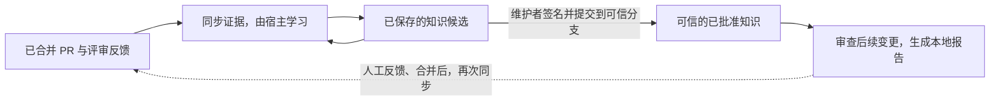

# Review Memory

[English](README.md) | 简体中文

让项目的评审知识**像滚雪球一样，从一个 PR 生长到下一个 PR**：
从已合并 PR 中学习，保存有用的经验，用已批准的知识辅助后续评审，
再随着新的 PR 反馈不断补充和修正这份记忆。

**PR 经验 → 项目记忆 → 带着经验评审 → 新的 PR 经验。**

[运转流程](#运转流程) | [安装](#安装) | [第一次使用](#第一次使用指定项目)

## 设计理念：滚雪球，而不是静态检查清单

一次 PR 评审留下的往往不只是“这里要改”，还有接口为什么这样设计、团队在意什么取舍、
某种看起来不推荐的写法为什么在这里反而合理。这些判断不应该随着 PR 关闭而散落，
也不应该在每次评审、每个新会话里从头学习。

因此，持续进化的是**项目知识，而不是模型权重**。每轮学习都把新证据与已有经验对照：
有的补充支持证据，有的揭示反例，有的说明旧知识应该修订甚至退出使用。
“雪球变大”不只是规则数量增加，而是对这个项目的决策、适用条件和例外理解得更具体；
它不应变成一张越来越长的禁令清单。

一条有用的知识需要记录原则、适用路径与上下文、例外、正反例，以及带版本的证据链接。
重复出现的评论、已解决的讨论和已合并的 PR 都是需要分析的证据，
并不自动代表团队共识，更不等于规则已经获准生效。

**假设示例，并非真实项目证据：**第一个 PR 暴露出请求边界缺少诊断上下文，
形成一条经验；后一个 PR 提醒不能记录敏感请求值，于是需要补充例外；
再后来的重构把上下文处理集中到统一入口，又需要缩小原有规则的适用范围。
记忆应该保留这些观察，支持提出修订，而不是把第一条评论固化成“所有地方都要打日志”。

### 各部分负责什么

这是**一个 Skill**，而不是一组分别触发的 Rust Skill：

| 部分 | 职责 |
| --- | --- |
| Skill 指令与工作流文档 | 引导助手完成采集、学习、审批和审查。 |
| Copilot 等宿主助手 | 阅读证据，将新观察与已有知识对照，提炼经验，并分析当前变更。 |
| 随 Skill 安装的 Python CLI | 通过已登录的 `gh` 读取数据、保存进度、校验证据和签名、运行符合条件的固定检测器，并生成本地产物；不直接调用模型 API。 |
| 目标项目的 `.review` 目录 | 跨会话保存项目记忆，与 Skill 安装位置分离。 |
| Rust 参考包 | 提供审查问题和反例，不是项目规则，也不是独立触发的 Skill。 |

## 运转流程



1. **采集证据。** `sync` 分批读取已合并 PR 的评审和讨论，保存可恢复的进度、
   证据版本和可获得的代码上下文。源码缺失或 API 读取失败会保留为明确的覆盖缺口。
2. **对照、提炼、保存。** 宿主同时阅读新证据和已有知识索引，考虑支持证据与反例，
   提出有适用范围的经验或修订。`propose` 校验并保存结果，`status` 重建累积索引。
   精确匹配的经验会归组并保留证据关联；语义合并仍由宿主判断。
   不是每个 PR 都必须产出一条新知识。
3. **人工批准。** 积累知识不需要先审批；要用于规则审查，维护者必须检查具体修订，
   按[审批流程](.github/skills/review-memory/references/approval.md)进行 SSH 签名，
   再将校验后的知识和审批记录提交到独立信任的目标分支。
   静态检测器还需要单独批准；助手不能代签或给自己授权。
4. **反哺后续评审。** `review` 固定 base/head 提交，以及维护者从 base 历史中选定的
   可信策略提交，使用符合条件的已批准规则，按需运行另行批准的固定检测器，
   并生成需要宿主推理的任务。`finalize` 校验宿主结果，输出包含证据和覆盖缺口的本地报告。
   纯静态检查可在准备阶段直接完成；人工规则仍需人工覆盖。
5. **进入下一轮。** 人继续评审、讨论和合并 PR。后续调用 `sync` 时，
   新增或变化的已合并 PR 证据再次与已有知识对照，推动下一轮修订提案。
   修改或停用已批准规则仍需要新的签名修订；本地模型发现不会被自动当作
   “已接受的历史反馈”重新灌入知识库。

这里的“持续”是**记忆持久化、每次调用接着学习**，不是安装后就自主运行。
Skill 不附带调度器或 webhook；增量 PR 元数据可能漏掉评论编辑，
完成待处理队列后可完整刷新反馈。采集完成、学习完成、规则获批是三个不同状态。

当前版本输出建议性的本地结果，不自动发 PR 评论、改代码或决定合并。
审查使用可信安装的运行时和不可变 Git 对象，不检出 PR 代码，不运行目标项目的构建、
测试或 hooks。当前唯一的固定检测器是 `rust.forbidden-dependency.v1`，
它分析 Cargo 依赖声明，而不是运行 Cargo。证据不足、知识过期或模型漏评都会保留为缺口，
“没有发现问题”不等于“已经证明没有问题”。详见[当前范围与限制](docs/pilot.md)。

## 安装

```powershell
npx skills add partychen/review-memory --skill review-memory -a github-copilot -g
```

需要 Node.js/npx，以及带 `venv`、`ensurepip` 的 Python 3.11+。
同步 GitHub 项目前，先完成 GitHub CLI 登录：

```powershell
gh auth login
```

已经登录的用户无需重复登录。首次使用时，助手会创建隔离 Python 环境，
安装随 Skill 分发、固定哈希的纯 Python PyYAML wheel。
**依赖准备完全离线，不访问 PyPI，也不需要编译器。**
不需要你另装 Python 后端或配置模型 API Key；下载 Skill 和同步 GitHub 仍需要相应的网络访问。

## 安装后怎么调用

**打开你要学习的项目，在 AI 助手的对话框里输入下面的话，而不是在 PowerShell 中输入。**

最直接的方式是明确写出 Skill 名称：

```text
使用 review-memory，同步这个项目的 PR，并积累评审知识。
```

在 Copilot CLI 中，也可以通过 `/review-memory` 显式指定：

```text
使用 /review-memory，同步这个项目的 PR，并积累评审知识。
```

“同步 PR”“学习历史评审”“积累评审知识”等任务描述可帮助助手自动匹配。
**推荐直接带上 `review-memory`，不要依赖单个关键词触发。**

如果安装时 Copilot CLI 已经打开，先在 CLI 会话内执行：

```text
/skills reload
/skills info review-memory
```

其他宿主如果没有刷新到新 Skill，重新打开会话，并确认安装时选择了对应宿主。

## 第一次使用：指定项目

在目标项目会话中输入，替换成你自己的 GitHub 项目：

```text
使用 review-memory。
项目是 https://github.com/acme/my-project，本地目录就是当前工作区。
同步已合并 PR 的评审记录，提炼经验并保存为项目知识。
```

这里的 `acme/my-project` 是**你要学习的项目**，不是安装命令中的 Skill 仓库。
如果缺少项目地址或本地目录，助手会询问，不会替你随意选择。

这会启动上面的采集与学习阶段：助手记录项目绑定、准备运行环境、处理证据，
并报告已积累的知识和剩余工作，不会替你批准产生的候选。

默认每批处理 20 个 PR。历史较多或会话预算不足时会保存进度，下次继续。
如果只想学习某段历史，可以在首次连接时说明：

```text
使用 review-memory，为 acme/my-project 学习 2026-01-01 之后合并的 PR。
本地目录使用当前工作区。
```

## 后续常用指令

| 想做什么 | 在助手对话中输入 |
| --- | --- |
| 继续同步与学习 | 使用 review-memory，继续同步当前项目，并完成剩余知识提炼。 |
| 看进度 | 使用 review-memory，查看当前项目还有多少 PR 和学习任务待处理。 |
| 看积累的知识 | 使用 review-memory，汇总当前项目的知识，并列出支持它们的 PR。 |
| 完整补查历史反馈 | 使用 review-memory，完成待处理队列后，完整刷新历史 PR 的评审记录。 |
| 学习指定 PR | 使用 review-memory，学习 acme/my-project 的 PR #123，提炼并保存评审经验。 |
| 用已批准知识审查 | 使用 review-memory，按当前项目已批准的规则审查这次变更。 |

## 知识保存在哪里

都保存在**目标项目**的 `.review` 目录中：

| 路径 | 内容 |
| --- | --- |
| `.review/config.yaml` | 项目绑定 |
| `.review/local/state/sync.json` | 同步进度和待处理 PR |
| `.review/local/raw/evidence` | 带版本的 PR 证据及其可用性信息 |
| `.review/local/proposals` | 学习任务、宿主响应、知识候选及其证据关联 |
| `.review/local/learning/index.json` | 累积的**未批准**知识索引，供后续学习复用 |
| `.review/knowledge`、`.review/approvals` | 用于可信策略的知识修订与签名审批记录 |
| `.review/detectors` | 单独批准的固定检测器配置 |
| `.review/local/runs` | 本地审查任务、发现、报告与覆盖缺口 |

更新或重新安装 Skill 不会主动删除这些项目数据。
`.review/local` 默认不提交到 Git，避免把原始评审数据公开。

## 更多说明

- [安装、迁移与发布](docs/distribution.zh.md)
- [同步流程](.github/skills/review-memory/references/sync.md)
- [从历史中学习](.github/skills/review-memory/references/learning.md)
- [知识结构与生命周期](.github/skills/review-memory/references/knowledge.md)
- [知识审批](.github/skills/review-memory/references/approval.md)
- [代码审查](.github/skills/review-memory/references/review.md)
- [历史回放与独立评估](.github/skills/review-memory/references/replay.md)
